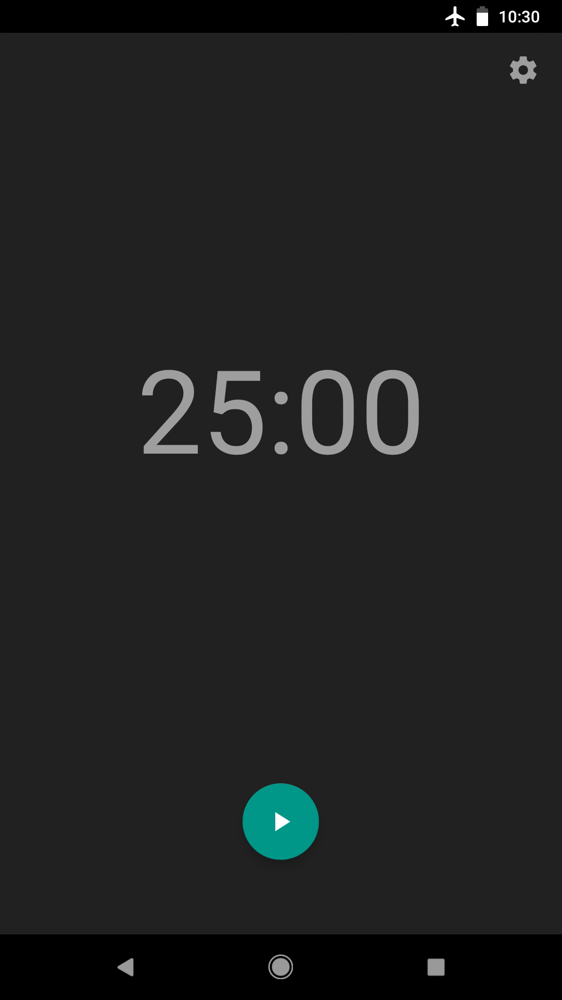
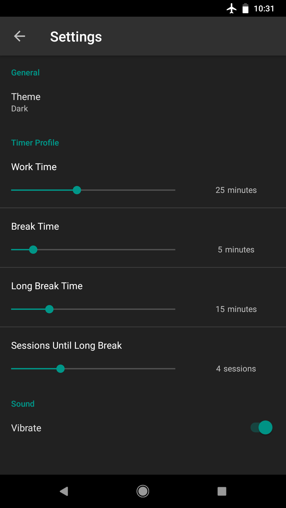

# <h1 align="center">MaterialTimer</h1>

MaterialTimer is a productivity focused timer that alternates between three configurable timers.

  
  
  

**Features:**

- Material Design
- Themes: Light, Dark, Black

- Ad-free and open source
- Configurable session duration
- Pause, resume, and reset functionality
- Vibrate at the end of each session
- Runs in background

  
  

Copyright 2018 Kristoffer Solomon

Licensed under the <a href="https://github.com/kmsolomo/Material_Timer/blob/master/LICENSE.txt">GNU General Public License v3.0</a>

## Open Source Libraries

<ul>

<li><a href="https://github.com/MrBIMC/MaterialSeekBarPreference"> Material SeekBar Preference</a></li>

</ul>
